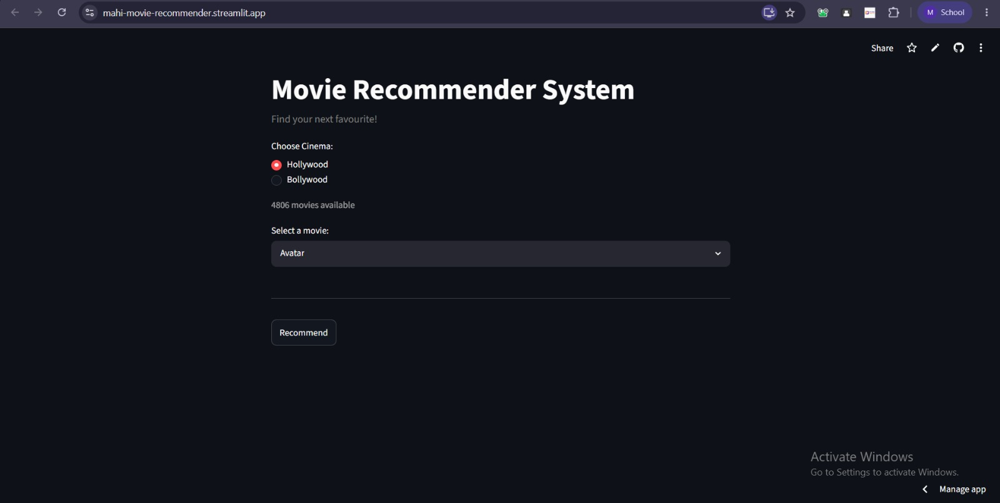

# Movie Recommender System

A content-based movie recommendation system that suggests similar Hollywood and Bollywood movies using NLP techniques, vectorization, and cosine similarity. The project is deployed as an interactive web application using Streamlit.

## About the Project

This project contains two recommendation systems:

- Hollywood Movie Recommender
- Bollywood Movie Recommender

Recommendations are generated by comparing movie metadata such as genres, keywords, cast, and other features.

## Live Demo

🔗 https://mahi-movie-recommender.streamlit.app

## Features

- Recommends movies similar to a given title
- Separate recommenders for Hollywood and Bollywood movies
- Uses content-based filtering
- Computes recommendations using cosine similarity
- Interactive web application using Streamlit
- Supports both Hollywood and Bollywood movies
- Optimized recommendations using precomputed recommendation files
- Deployed on Streamlit Community Cloud

## Technologies Used

- Python
- Pandas
- NumPy
- Scikit-learn
- Streamlit
- Pickle
- Jupyter Notebook
- Git & GitHub

## Project Structure

```
movie-recommender-system/
│
├── data/
│   ├── Data for repository.csv
│   ├── tmdb_5000_movies.csv
│   └── tmdb_5000_credits.csv
│
├── notebooks/
│   ├── hollywood_recommender.ipynb
│   └── bollywood_recommender.ipynb
│
├── app.py
├── requirements.txt
├── moviesH.pkl
├── moviesB.pkl
├── recommendationsH.pkl
├── recommendationsB.pkl
├── .gitignore
└── README.md
```

## Approach

1. Data preprocessing and cleaning
2. Feature engineering
3. Creating combined movie tags
4. Vectorization of text features
5. Computing cosine similarity
6. Generating recommendations

## Dataset Statistics

- Hollywood Movies: 4,806
- Bollywood Movies: 1,698
- Recommendation Technique: Content-Based Filtering
- Similarity Metric: Cosine Similarity

## Example

Input movie: `3 Idiots`

Recommended movies:
- PK
- Lage Raho Munna Bhai
- Taare Zameen Par
- Mangal Pandey – The Rising
- Dangal

## Screenshots

### Home Page


### Recommendations


## Future Improvements

- Display movie posters and ratings
- Add movie descriptions and genres
- Implement search suggestions/autocomplete
- Include more regional movie industries
- Experiment with hybrid recommendation techniques

## Author

Mahi Sureka  
Indian Institute of Technology Hyderabad
